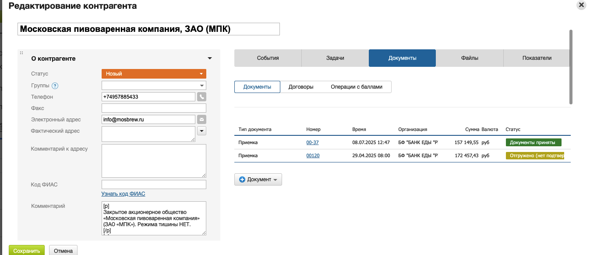
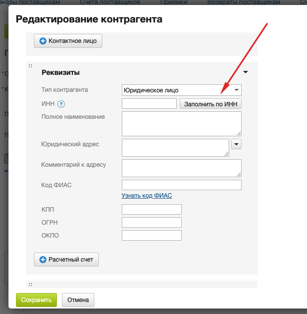

[⬅️ Оглавление](../README.md)

# Заведение доноров в МойСклад 

## Процедура внесения донора

**Карточку донора заводит юрист после валидации** и на основании информационной карточки донора.

**Порядок действий:**
1. **Информационную карточку компании выслать юристу** и запросить завести карточку в МойСклад
2. **Юрист создает карточку контрагента** после успешной валидации
3. **Необходимо постоянно актуализировать информацию** по донорам: реквизиты, контакты, адреса, склады и проч.

## Создание карточки контрагента

**Контрагенты** — это юридические или физические лица, которые работают с вами в качестве поставщиков или покупателей.

### Пошаговая инструкция создания контрагента

1. **Перейдите в раздел Контрагенты → Контрагенты**
2. **Нажмите на кнопку "+Контрагент"**
3. **Заполните обязательные поля:**
   - **Наименование контрагента** - полное название организации или ФИО физического лица
   - **Тип контрагента** - выберите из списка (организация, индивидуальный предприниматель, физическое лицо)

*Рис. 1. Окно редактирования карточки контрагента*

4. **Заполните контактную информацию:**
   - **Номер телефона** - для звонков и отправки документов прямо из МойСклад
   - **Email** - для отправки документов и уведомлений
   - **Фактический адрес** - будет автоматически подгружаться в Заказ покупателя и Отгрузку
   - **Юридический адрес** - используется, если фактический адрес не указан

5. **Укажите реквизиты (для организаций):**
   - **ИНН** - идентификационный номер налогоплательщика
   - **ОГРН** - основной государственный регистрационный номер
   - **КПП** - код причины постановки на учет
   - **Банковские реквизиты** - автоматически подгрузятся в любой документ

*Рис. 2. Автоматическое заполнение реквизитов по ИНН при создании контрагента*

6. **Укажите группу контрагента:**
   - Впишите название группы вручную или выберите из списка 
   - Можно указать несколько групп для одного контрагента

7. **Сохраните контрагента:**
   - Нажмите на кнопку "Сохранить"
   - Затем нажмите "Закрыть"

### Наполнение справочника контрагентов

**Способы добавления контрагентов:**
- **Вручную** - создание карточек по одной
- **Импорт** - загрузка данных из файлов Excel или CSV
- **При создании документа** - добавление нового контрагента прямо в документе

**Рекомендации:**
- Не обязательно наполнять справочник сразу
- Можно добавлять контрагентов по ходу работы
- Используйте импорт для больших объемов данных

### Типы контрагентов в системе

| Тип контрагента | Описание | Особенности |
|-----------------|----------|-------------|
| **Донор** | Организация, предоставляющая товары безвозмездно | Указывается в приемках |
| **Поставщик** | Организация, поставляющая товары на коммерческой основе | Указывается в заказах поставщикам |
| **НКО** | Некоммерческая организация - получатель помощи | Указывается в отгрузках |
| **Волонтер** | Доброволец, участвующий в работе | Создается как физическое лицо |
| **Координатор** | Сотрудник, координирующий работу волонтеров | Создается как физическое лицо |
| **Партнер** | Организация, сотрудничающая с банком еды | Может быть донором или получателем |
| **Подрядчик** | Организация, выполняющая работы/услуги | Указывается в актах выполненных работ |

### Поиск и редактирование контрагентов

**Поиск контрагента:**
1. Перейдите в раздел Контрагенты → Контрагенты
2. Используйте поле поиска вверху страницы
3. Введите название, ИНН или часть названия
4. Результаты отобразятся в списке

**Редактирование карточки:**
1. Найдите нужного контрагента в списке
2. Нажмите на название контрагента
3. Внесите необходимые изменения
4. Нажмите "Сохранить"

**Фильтрация контрагентов:**
- Используйте фильтры для поиска по группам
- Сохраняйте часто используемые фильтры как закладки
- Экспортируйте отфильтрованные данные при необходимости

> *Источник: Регламент работы с 1С УНФ*  
> *Дата обновления: 10.07.2025* 