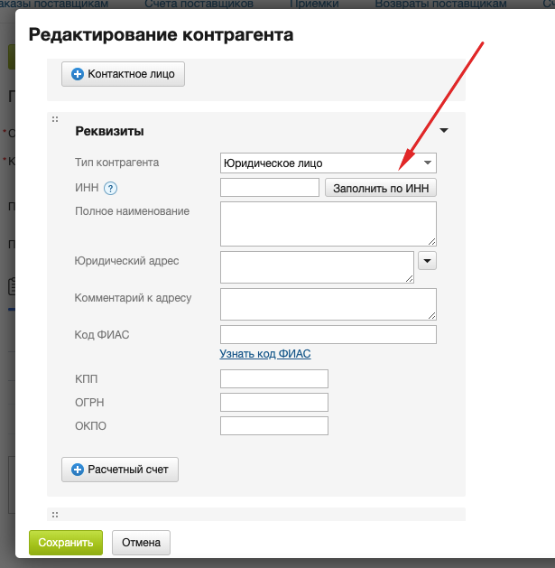

5. # Внесение договора в МойСклад

## Описание процесса

Договоренности с поставщиками/донорами фиксируются в договорах — по ним удобно искать документы в рамках работы с определенными контрагентами и контролировать взаиморасчеты.

## Создание договора

### Шаг 1: Переход в раздел договоров
1. Зайдите в раздел **Контрагенты** → **Договоры**
2. Нажмите кнопку **+Договор**

### Шаг 2: Заполнение основных реквизитов
В открывшемся окне заполните:

1. **Организация** — выберите вашу организацию из списка
2. **Контрагент** — выберите контрагента, с которым заключается договор

> ℹ️ **Совет:** Для быстрого заполнения реквизитов используйте автоматическое заполнение по ИНН. Подробнее см. раздел [Внесение донора в МойСклад](01_donor_entry.md#визуальные-примеры-интерфейса)

*Рис. 1. Пример автоматического заполнения реквизитов по ИНН в карточке контрагента*

> **Важно:** Реквизиты подставятся автоматически из карточек вашего юрлица и контрагента

### Шаг 3: Дополнительные настройки
При необходимости заполните:
- **Номер договора** — если не заполнен, система сгенерирует автоматически
- **Дата договора** — дата подписания
- **Срок действия** — период действия договора
- **Валюта** — валюта договора (по умолчанию — рубли)

### Шаг 4: Сохранение
Нажмите кнопку **Сохранить** для создания договора в системе.

## Особенности работы с договорами

### Автоматическое заполнение
- Реквизиты организации и контрагента подставляются автоматически
- Номер договора генерируется системой при необходимости
- Даты можно изменить вручную при необходимости

### Поиск и контроль
- Договоры используются для поиска документов по контрагентам
- Контроль взаиморасчетов по договорам
- Фильтрация документов по конкретным договорам

## Связанные разделы

- **[Заведение донора](01_donor_entry.md)** — создание карточки контрагента
- **[Согласование договора](02_contract_approval.md)** — процесс согласования
- **[Нумерация договоров](03_contract_numbering.md)** — правила нумерации
- **[Подписание договора](04_contract_signing.md)** — процедуры подписания

---

**Дата обновления:** 10.07.2025  
**Статус:** Адаптировано для МойСклад  
**Версия:** 2.0

