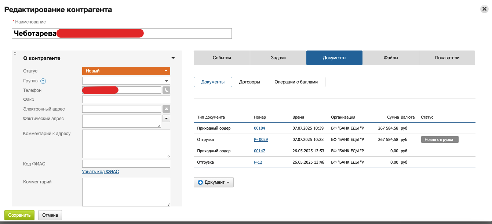

# Инструкция по работе с волонтерами в МойСклад

## Оглавление
- [Заведение волонтера в систему](#заведение-волонтера-в-систему)
- [Оформление карточки волонтера](#оформление-карточки-волонтера)
- [Работа с волонтером при отгрузке](#работа-с-волонтером-при-отгрузке)
- [Учет и отчетность по волонтерам](#учет-и-отчетность-по-волонтерам)
- [Полезные ссылки](#полезные-ссылки)

---

## Заведение волонтера в систему

1. Перейдите в раздел **Контрагенты → Контрагенты**
2. Нажмите **+Контрагент**
3. В поле **Тип контрагента** выберите "Физическое лицо"
4. Заполните ФИО, контактные данные, при необходимости — паспортные данные
5. Укажите группу "Волонтеры" для удобства поиска и фильтрации
6. Прикрепите необходимые документы (договор, согласие на обработку ПД и др.)
7. Сохраните карточку волонтера

*Рис. 1. Пример карточки волонтера в системе МойСклад*

---

## Оформление карточки волонтера

- В карточке волонтера храните все основные данные: ФИО, контакты, паспортные данные (при необходимости), группу "Волонтеры", прикрепленные файлы (договор, согласие и др.)
- Для поиска используйте фильтры по группе или ФИО
- Для редактирования откройте карточку волонтера и внесите изменения

*Рис. 2. Окно редактирования карточки волонтера*

---

## Работа с волонтером при отгрузке

- Для оформления отгрузки на волонтера используйте тип документа "Отгрузка" и выберите волонтера как контрагента
- После раздачи волонтер предоставляет ведомость раздач и фотоотчет
- Для закрытия отгрузки создается приходный ордер с прикреплением сканов ведомости и фото

Подробнее см. раздел [Фиксация распределения пожертвования](15_distribution_fixation_moysklad.md#процесс-работы-с-точками-раздач)

*Рис. 3. Пример оформления отгрузки на волонтера*

*Рис. 4. Пример приходного ордера, созданного на основании отчета волонтера*

---

## Учет и отчетность по волонтерам

- Ведите учет всех отгрузок на волонтеров через фильтры и отчеты по контрагентам
- Храните ведомости раздач и фотоотчеты в карточке волонтера или в связанных документах
- Используйте статусы и комментарии для контроля выполнения обязательств волонтера

---

## Полезные ссылки
- [Фиксация распределения пожертвования (отгрузка на волонтера)](15_distribution_fixation_moysklad.md#процесс-работы-с-точками-раздач)
- [Внесение донора/волонтера в систему](01_donor_entry.md#визуальные-примеры-интерфейса) 