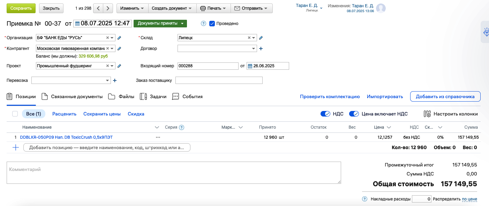

[⬅️ Оглавление](../README.md)

# Приемка продукции от поставщиков

## Описание процесса

Приемка продукции в МойСклад осуществляется через создание документа "Приемка" в разделе "Закупка". Это позволяет фиксировать поступление товаров от доноров и поставщиков в системе.

## Порядок действий при приемке

### Шаг 1: Проверка товаросопроводительных документов

При получении продукции ответственный за приемку проверяет:

- **Количество мест** в соответствии с товаросопроводительными документами
- **Сроки годности** продукции
- **Целостность** упаковки и продукции
- **Качество** товара (отсутствие порчи, боя)

> **Важно:** При любых несоответствиях до отъезда водителя ответственный за приемку должен сообщить менеджеру ЦО о несоответствиях.

### Шаг 2: Получение необходимых документов

Документы, которые должны быть получены по результатам отгрузки:

- **ТТН/Торг-12/ТТ** — товарно-транспортная накладная
- **АПП** — акт приема-передачи
- **Сертификаты качества и соответствия** — в зависимости от продукции
- **ВСД** — ветеринарные сопроводительные документы (для продукции, проходящей через Меркурий)

### Шаг 3: Оформление документа "Приемка" в МойСклад

#### Чек-лист: Оформление документа "Приемка"

1. **Перейти в раздел "Закупка" → "Приемка"**
2. **В разделе "Файлы" загрузить фотографии:**
   - УПД (универсальный передаточный документ)
   - ТТН (товарно-транспортная накладная)
3. **Заполнить обязательные поля:**
   - **Контрагент** — донор/поставщик
   - **Проект** — промышленный фудшеринг
   - **Склад** — регион получения
   - **Входящий номер** — номер ТТН или УПД
   - **Дата** — дата ТТН или УПД
4. **Выбрать номенклатуру:**
   - Промышленный фудшеринг. Весовой товар
   - Промышленный фудшеринг. Штучный товар

### Шаг 4: Контроль качества продукции

**Ассортимент, внутритарное вложение и качество** (просрок, порча, бой продукции) проверяется в течение **10 дней** после подписания товаросопроводительных документов.

## Обработка продукции ненадлежащего качества

### Порядок действий при обнаружении брака:

1. **Фиксация несоответствий:**
   - НКО/РО фиксируют артикул, номенклатуру, количество продукции ненадлежащего качества
   - Сообщают ответственному менеджеру ЦО по электронной почте

2. **Временное хранение:**
   - НКО/РО не выбрасывают и не утилизируют продукцию
   - Хранят продукцию ненадлежащего качества до согласования с донором

3. **Согласование с донором:**
   - Менеджер ЦО оповещает донора об обнаружении продукции ненадлежащего качества
   - Согласовывает дальнейшие действия

4. **Варианты решения:**
   - **Утилизация:** передача в утилизирующую компанию с получением подтверждающих документов
   - **Уничтожение:** освобождение от упаковки, фото/видео подтверждение уничтожения
   - **Возврат донору:** согласование способа доставки и корректировки документов

## Документооборот

### Сохранение документов

Все товаросопроводительные документы в **ОБЯЗАТЕЛЬНОМ порядке** необходимо сохранять:

- **В виде сканов** в соответствующей папке донора
- **На Яндекс.Диске** для быстрого доступа
- **В МойСклад** в разделе "Файлы" документов

### Отчетность

НКО/РО в день поставки необходимо:

1. Прислать скан накладной ответственному менеджеру ЦО
2. Написать, сошлось ли фактическое количество с количеством в накладной
3. После загрузки документов написать письмо ответственному менеджеру ЦО с указанием пути сохранения

## Связанные разделы

- **[Работа с Меркурием](02_mercury.md)** — оформление поднадзорной продукции
- **[Фиксация приемки](03_product_receipt_fixation.md)** — завершение процесса приемки
- **[Отчетность донору](04_documentation_reporting_donor.md)** — предоставление отчетов

---

**Дата обновления:** 10.07.2025  
**Статус:** Адаптировано для МойСклад  
**Версия:** 2.0

