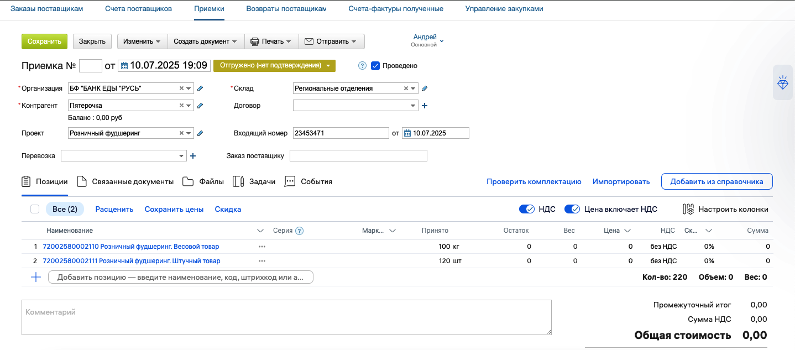
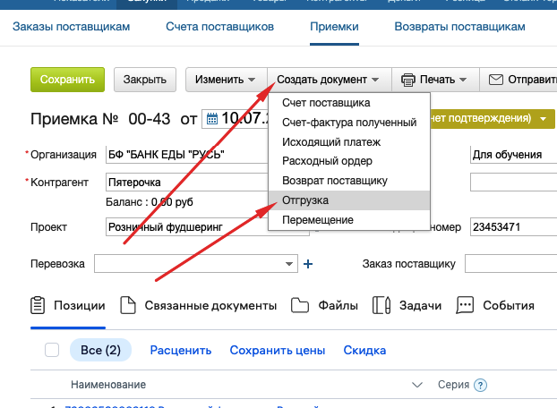
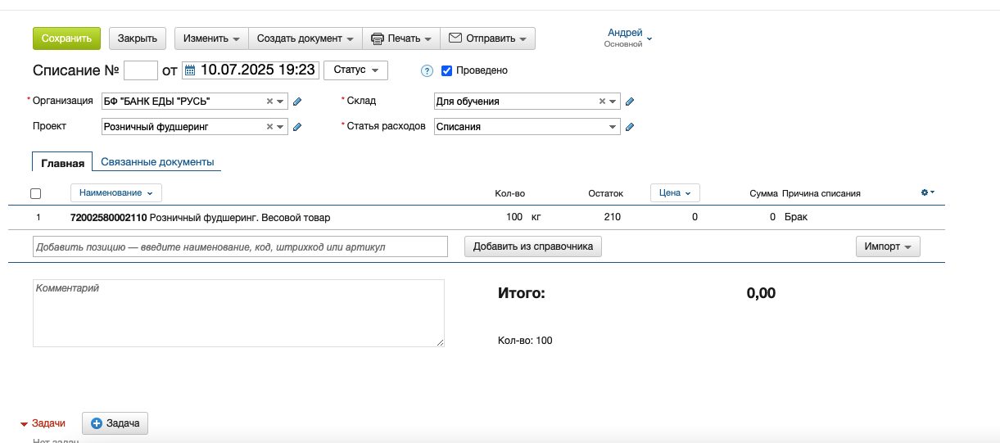
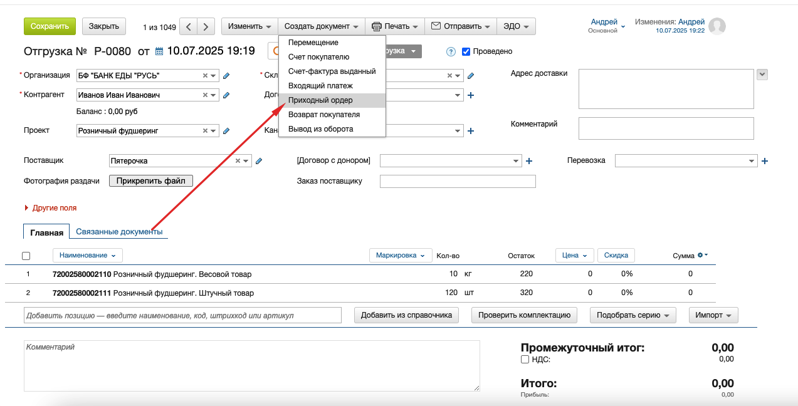
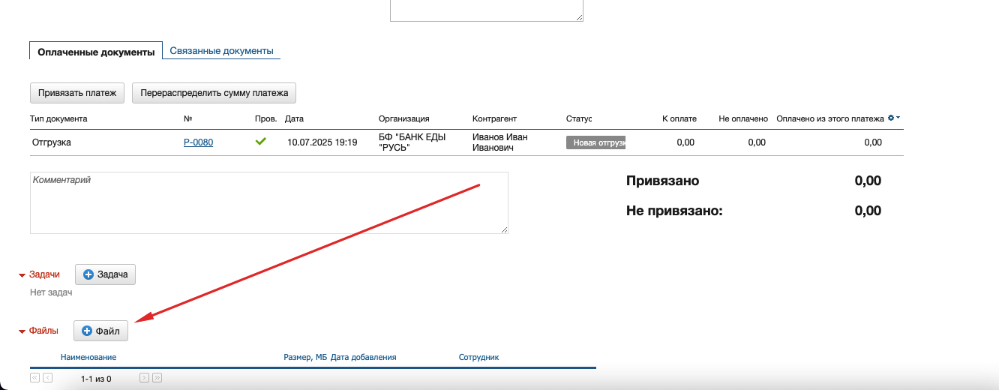

[⬅️ Оглавление](../README.md)

# Этап реализации розничного фудшеринга

## Оглавление
- [Взаимодействие в чате](#взаимодействие-в-чате)
- [Процесс работы волонтёра](#процесс-работы-волонтёра)
- [Отчетность](#отчетность)
- [Взаимодействие с торговыми точками](#взаимодействие-с-торговыми-точками)
- [Оформление документов в системе "Мой склад"](#оформление-документов-в-системе-мой-склад)
- [Работа с волонтером при отгрузке](#работа-с-волонтером-при-отгрузке)
- [Завершение отчетного периода](#завершение-отчетного-периода)

---

## Взаимодействие в чате

> 💬 **Визуальный блок:**
> - Чаты с магазинами (WhatsApp, Telegram) созданы по регионам и сетям.
> - Координаторы ежедневно уточняют наличие продукции.

---

## Процесс работы волонтёра

### Чек-лист: Действия волонтёра
- [ ] Получить информацию от координатора в чате
- [ ] Приехать в магазин
- [ ] Пройти идентификацию (по ID и паспорту для Х5, по доверенности и паспорту для Магнит)
- [ ] Сверить все позиции и подписать Акт ПП/отчет о списании (Х5) или ТТН (Магнит)
- [ ] Пересчитать и оценить состояние продукции
- [ ] Отписаться в чат координатору о заборе продукции
- [ ] Сформировать наборы и выдать их нуждающимся

---

## Отчетность

> 📸 **Визуальный блок:**
> - Фото ТТН/Акт ПП или отчет о списании
> - Фото ведомости (за день или месяц)
> - Фото с благополучателями
> - Фото в магазине с продукцией

---

## Взаимодействие с торговыми точками

> ⚠️ **Контроль отсутствия передач:**
> - Если нет передачи более 1 недели, региональные партнеры уточняют причину у директоров магазинов.
> - По Х5 — еженедельная ссылка с комментариями от директоров.

---

## Оформление документов в системе "Мой склад"

### Чек-лист: Оформление документа "Приемка"
- [ ] Перейти в раздел "Закупка" → "Приемка"
- [ ] В разделе "Файлы" загрузить фотографии УПД и ТТН
- [ ] Заполнить поля:
  - Контрагент (донор)
  - Проект (розничный фудшеринг)
  - Склад (регион)
  - Входящий номер (ТТН или УПД)
  - Дата (ТТН или УПД)
- [ ] Выбрать номенклатуру:
  - Розничный фудшеринг. Весовой товар
  - Розничный фудшеринг. Штучный товар

---

### Чек-лист: Создание документа "Отгрузка"
- [ ] Создать документ "Отгрузка"
- [ ] Указать:
  - Контрагент: волонтёр
  - Проект: розничный фудшеринг
  - Поставщик: торговая сеть
  - Склад: ваш регион
  - Номенклатура: фактически выданная волонтёру

### Работа с волонтером при отгрузке

При передаче продукции волонтерам для раздачи необходимо:

- Для оформления отгрузки на волонтера используйте тип документа "Отгрузка" и выберите волонтера как контрагента
- После раздачи волонтер предоставляет ведомость раздач и фотоотчет
- Для закрытия отгрузки создается приходный ордер с прикреплением сканов ведомости и фото

*Рис. 1. Пример оформления отгрузки на волонтера*

*Рис. 2. Пример приходного ордера, созданного на основании отчета волонтера*

Подробнее см. раздел [Фиксация распределения пожертвования](15_distribution_fixation_moysklad.md#процесс-работы-с-точками-раздач)

---

### Чек-лист: Оформление акта списания
- [ ] Перейти в раздел "Товары → Списания"
- [ ] Перейти по ссылке: [https://online.moysklad.ru/app/#loss](https://online.moysklad.ru/app/#loss)
- [ ] Заполнить поля:
  - Проект
  - Склад
  - Номенклатура
  - Причина списания (брак, просрочка и т.п.)

---

### Чек-лист: Загрузка фотоотчетов волонтёра
- [ ] Зайти в документ "Отгрузка"
- [ ] Нажать "Создать документ → Приходный ордер"
- [ ] В разделе "Файлы" загрузить фотографии раздачи и скан ведомости раздачи

---

## Завершение отчетного периода

> 🗓️ **Визуальный блок:**
> - По итогам месяца производится сверка по каждой сети.
> - Сроки предоставления отчетных документов:
>   - Пятерочка: до 2 числа
>   - Перекрёсток: до 10 числа
>   - Магнит: до 7 числа
> - Все фотоотчеты и документы сохраняются на Яндекс.Диске и в "Мой склад".

---

**Важнейшей частью проекта является взаимодействие!**

> 🤝 **Совет:**
> Постоянное взаимодействие и четкое распределение ответственности между всеми участниками — залог успешной реализации проекта.

---

**Дата создания**: 09.07.2025  
**Источник**: Предоставленный текст  
**Статус**: Описание этапа реализации 